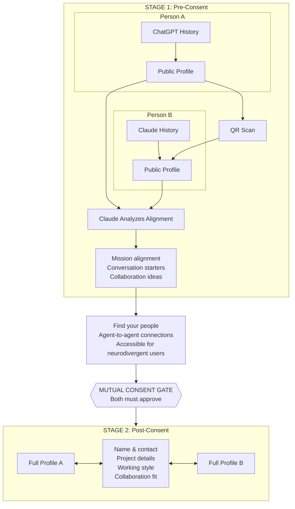

# Mission Match

**Turn your AI conversations into a collaboration profile. Connect at events through a two-stage consent protocol.**

> *"We don't come with user manuals."*
> — [Mapping the Human API](https://www.linkedin.com/pulse/mapping-human-api-christopher-k-lee-marks-tc6sc/)

---

## The Problem

Networking events are broken:
- **High friction**: Business cards get lost, LinkedIn requests go ignored
- **No signal**: Hard to assess collaboration fit in 30 seconds
- **Privacy theater**: You share your contact before knowing if there's mutual interest
- **Context collapse**: Your AI already knows your projects, goals, and working style—but strangers don't

## The Solution: A Two-Stage Consent Protocol



**Why this matters:**
- **Find your people** — surface alignment before the awkward small talk
- **Built for the agent world** — your AI brokers connections on your behalf
- **Accessible** — lowers barriers for neurodivergent folks who find initiating conversations challenging

---

## Philosophy: The Human API

Mission Match is a proof-of-concept implementation of a **Human API** pattern—applying software architecture principles to human connection.

```
GET  /api/human/{id}/public   →  Anonymized collaboration profile
GET  /api/human/{id}/full     →  Complete profile (requires consent token)
POST /api/handshake           →  Initiate two-stage consent
POST /api/consent             →  Grant access to full profile
```

This mirrors how software systems build trust:

| Layer | Software | Human API |
|-------|----------|-----------|
| **0** | TCP handshake | QR scan initiates connection |
| **1** | Context negotiation | Stage 1 overlap analysis |
| **2** | Authentication | Mutual consent gate |
| **3** | Full access | Stage 2 profile exchange |

> *"Interfaces shape outcomes. Most of us are running protocols we never consciously chose."*

By making the consent protocol explicit, we give users **sovereignty over their data** at every step.

---

## Innovation: Facilitates, Doesn't Filter

Most networking tools **filter** people—ranking, scoring, recommending who to meet.

Mission Match **facilitates** connection:

| Traditional Matching | Mission Match |
|---------------------|---------------|
| "82% compatibility score" | "Here's what to talk about" |
| Algorithm decides who you see | You decide after seeing overlap |
| Platform optimizes for engagement | User optimizes for real connection |
| Black box scoring | Transparent analysis |

We show:
- ✅ **Mission alignment** — shared goals and values
- ✅ **Conversation starters** — specific questions to ask
- ✅ **Collaboration ideas** — concrete things to build together

**The AI is a facilitator, not a gatekeeper.**

---

## Track 3: Personal Data → Personal Value

This project directly addresses Track 3's challenge:

> *"Build services that analyze a user's own exported data and give them something they couldn't see before."*

### The Data Story

| Question | Answer |
|----------|--------|
| **Where does the data come from?** | User's own ChatGPT/Claude conversation history (copy-paste) |
| **Who owns the data?** | The user. True deletion available — removes profile, handshakes, and all analyses from the database |
| **How is consent handled?** | Two-stage: public profile visible pre-consent, full profile only after mutual consent |
| **What insight do they get?** | AI extracts collaboration patterns, working style, and proof points they couldn't articulate themselves |

### What We Extract From Your AI History

```
INPUT: 500+ messages of ChatGPT/Claude conversation

OUTPUT:
├── Mission & Hook
│   "Building AI tools that strengthen human connection"
│
├── Proof Points
│   Concrete evidence of what you've built — projects, metrics, outcomes
│   • LoveNotes: 2000+ messages, 80% engagement rate
│   • Podcast Farm: $360K revenue
│
├── Working Style
│   How you actually operate — communication patterns, pace, preferences
│   • Ships fast, iterates in public
│   • Prefers async communication
│   • High tolerance for rough edges
│
└── Collaboration Fit
    What you're looking for and what you bring to the table
    • Looking for: Technical co-founders
    • Availability: 10-20 hrs/week
    • Stage: Ready to build
```

This is the Track 3 example come to life:
> *"A tool that analyzes a user's ChatGPT conversation history to surface recurring anxieties, growth themes, and decision patterns"*

We surface **collaboration patterns**—what you build, how you work, who you work well with.

### Data Lineage & Provenance

**Every claim traces back to source.** When Claude extracts your profile, we capture provenance metadata:

| Field | Purpose |
|-------|---------|
| `extracted_at` | Timestamp of extraction |
| `model_version` | Which Claude model processed the data |
| `source_word_count` | Size of original conversation |
| `user_reviewed` | Whether user approved the extraction |

This creates a **trust chain for agent-to-agent verification** — when your AI negotiates connections on your behalf, the other agent can verify the provenance of your claims.

**True deletion**: Users can permanently delete their profile and all associated data (handshakes, analyses) with a single action. No soft deletes, no data retention — it's gone from the database.

---

## Demo Flow (60 seconds)

1. **Create Profile** (15s) — Paste AI conversation → Claude extracts profile → Get QR code
2. **Scan & Connect** (15s) — Person B scans QR → Handshake created → Stage 1 analysis runs
3. **See Overlap** (15s) — Both see mission alignment, conversation starters, collaboration ideas
4. **Mutual Consent** (15s) — Both approve → Full profiles exchanged → Connection complete

---

## What Makes This Work

### Completeness

This is a **full working system**, not a slide deck:

- ✅ Real Claude API integration (profile extraction + overlap analysis)
- ✅ Real database with consent state machine
- ✅ Real two-phone QR flow tested on iOS + Android
- ✅ Real-time updates when consent is granted
- ✅ Privacy scoping: Stage 1 hides sensitive fields until Stage 2

### Engineering Depth

- **Profile visibility scoping**: Server-side enforcement of what data is visible at each stage
- **Consent state machine**: Tracks initiator/recipient consent independently
- **Cache-busting**: Vercel edge caching defeated with explicit `no-store` headers
- **Profile extraction**: Structured prompts with JSON repair for malformed ChatGPT output

---

## The Vision

**Today**: A working QR-based handshake tool for networking events.

**Tomorrow**: An open protocol for agent-to-agent consent—where your AI negotiates connections on your behalf, with full transparency and user sovereignty.

**The Human API isn't just a metaphor.** It's infrastructure for a future where AI mediates human connection without extracting human agency.

---

## Technical Details

### Architecture

```mermaid
flowchart TB
    subgraph CLIENT["🖥️ CLIENT (Next.js)"]
        R1["/ — Create profile"]
        R2["/profile — QR code + connections"]
        R3["/connect/:id — Initiate handshake"]
        R4["/handshake-result/:id — View & consent"]
    end

    subgraph API["⚡ API ROUTES"]
        A1["POST /api/extract-profile"]
        A2["POST /api/create-handshake"]
        A3["POST /api/grant-consent"]
        A4["GET /api/get-handshake"]
        A5["GET /api/get-profile"]
    end

    subgraph SERVICES["🔧 SERVICES"]
        CLAUDE["🤖 Claude API<br/>(Sonnet 4.5)<br/>• Profile extraction<br/>• Overlap analysis"]
        SUPA["🗄️ Supabase<br/>(PostgreSQL)<br/>• profiles<br/>• handshakes<br/>• analyses"]
    end

    CLIENT --> API
    API --> CLAUDE
    API --> SUPA

    style CLIENT fill:#1a1a2e,stroke:#4f46e5
    style API fill:#1a1a2e,stroke:#f59e0b
    style SERVICES fill:#1a1a2e,stroke:#22c55e
```



### Tech Stack

- **Frontend**: Next.js 14 (App Router, TypeScript)
- **Database**: Supabase (PostgreSQL)
- **AI**: Claude Sonnet 4.5 via Anthropic SDK
- **Hosting**: Vercel
- **QR Codes**: react-qr-code

### Local Development

```bash
git clone https://github.com/ckelimarks/mission-match.git
cd mission-match/web
npm install
cp .env.local.example .env.local  # Add credentials
npm run dev
```

### Environment Variables

```bash
NEXT_PUBLIC_SUPABASE_URL=        # Supabase project URL
NEXT_PUBLIC_SUPABASE_ANON_KEY=   # Supabase anon key
SUPABASE_SERVICE_ROLE_KEY=       # Supabase service role key
ANTHROPIC_API_KEY=               # Anthropic API key
NEXT_PUBLIC_APP_URL=             # https://mission-match.vercel.app
```

---

## Team

Built for the **Data Portability Hackathon** (March 9, 2026) by K-Lee and Jaya.

## Links

- **Live Demo**: [mission-match.vercel.app](https://mission-match.vercel.app)
- **Human API Essay**: [Mapping the Human API](https://www.linkedin.com/pulse/mapping-human-api-christopher-k-lee-marks-tc6sc/)
- **Track**: 3 — Personal Data, Personal Value
