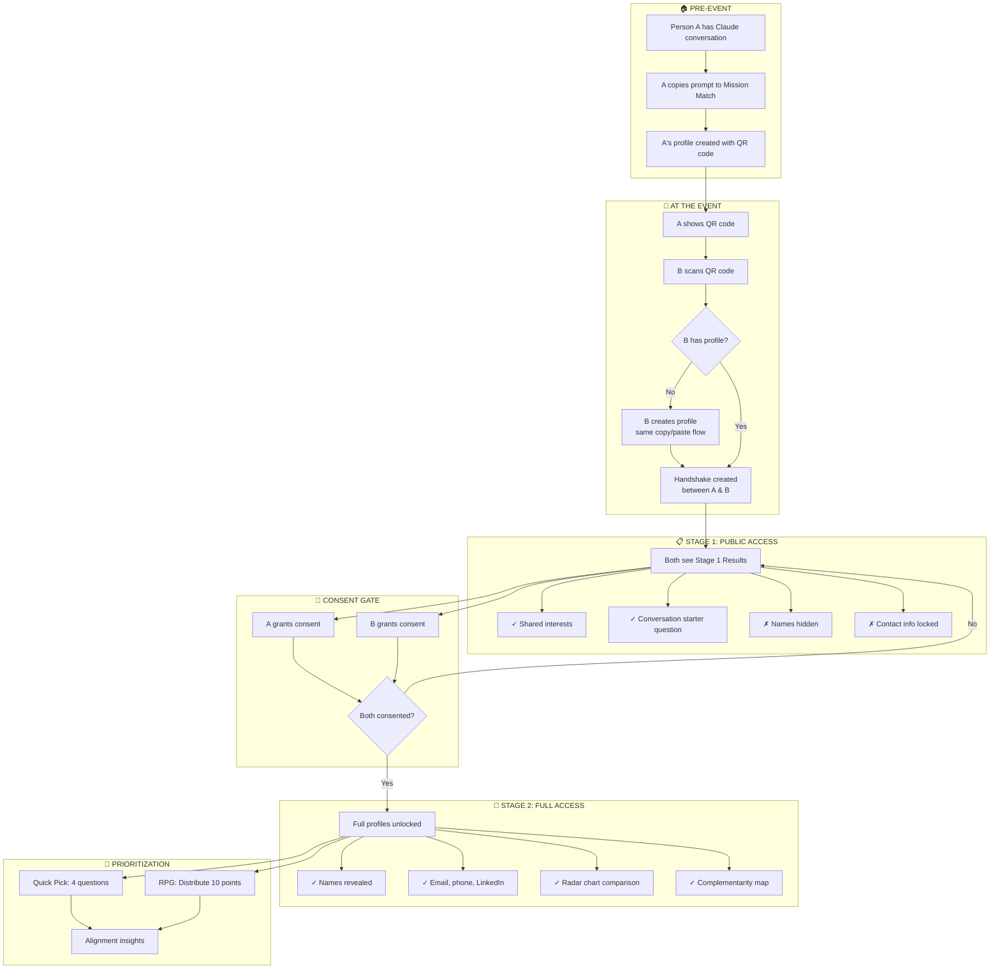

# Mission Match Flow

## Key Points

### Two-Stage Consent Model
Like Slack bot permissions - you see what you're granting before you grant it.

| Stage | What's Visible | What's Hidden |
|-------|---------------|---------------|
| Stage 1 | Aspects, interests, question | Name, email, phone, LinkedIn |
| Stage 2 | Everything | Nothing |

### Profile Creation
Both people need profiles. The flow supports:
- **A prepared**: Created profile before event
- **B spontaneous**: Creates profile after scanning A's QR

### The "Handshake"
When B scans A's QR, the system creates a handshake record linking both profiles. This triggers:
1. Stage 1 analysis (AI generates shared interests + question)
2. Consent tracking (who has granted what)
3. Stage 2 unlock when both consent

### Prioritization (Post-Consent)
After full access, both can reveal collaboration priorities:
- **Quick Pick**: Fast 4-question multiple choice
- **RPG Mode**: Distribute 10 points across 5 priorities
- **Output**: Alignment/divergence insights for first conversation
